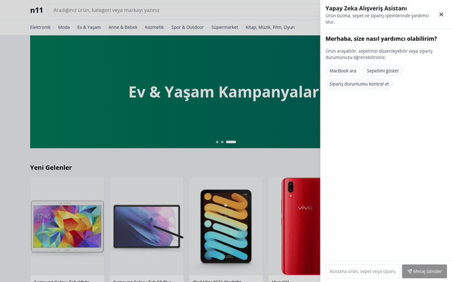
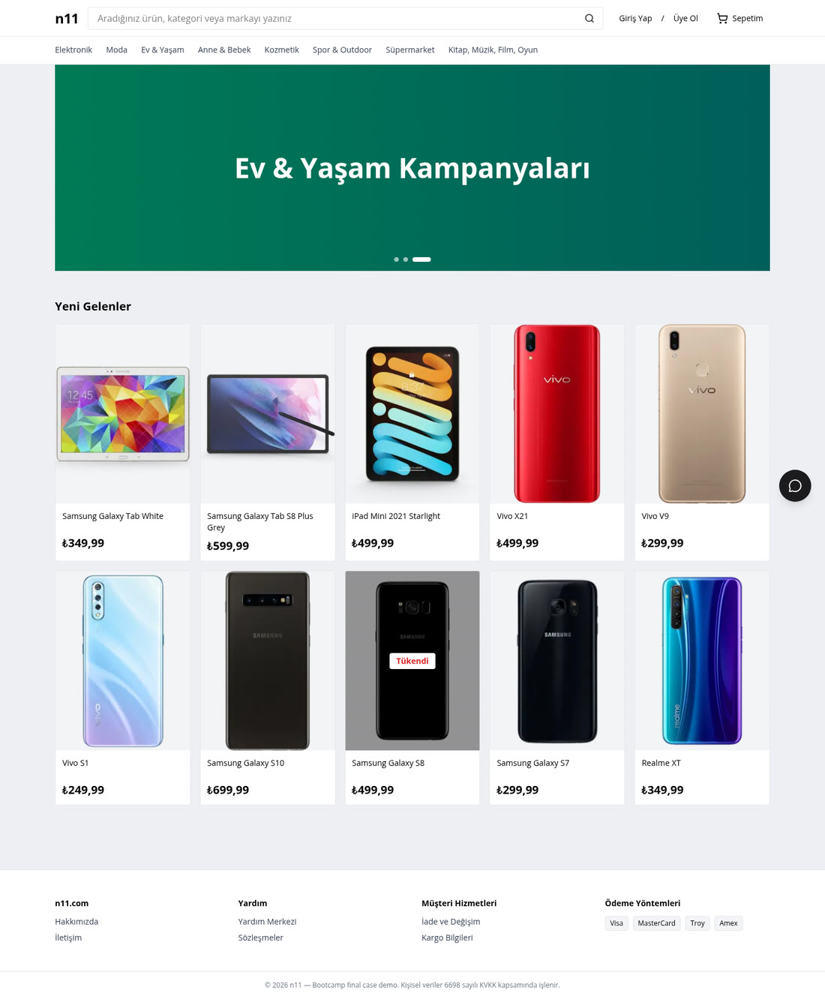
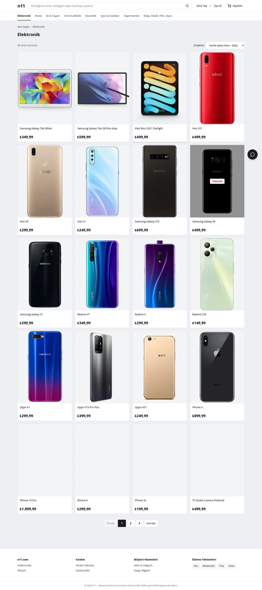
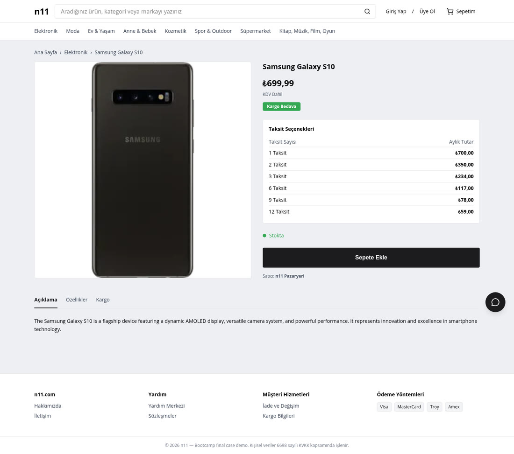
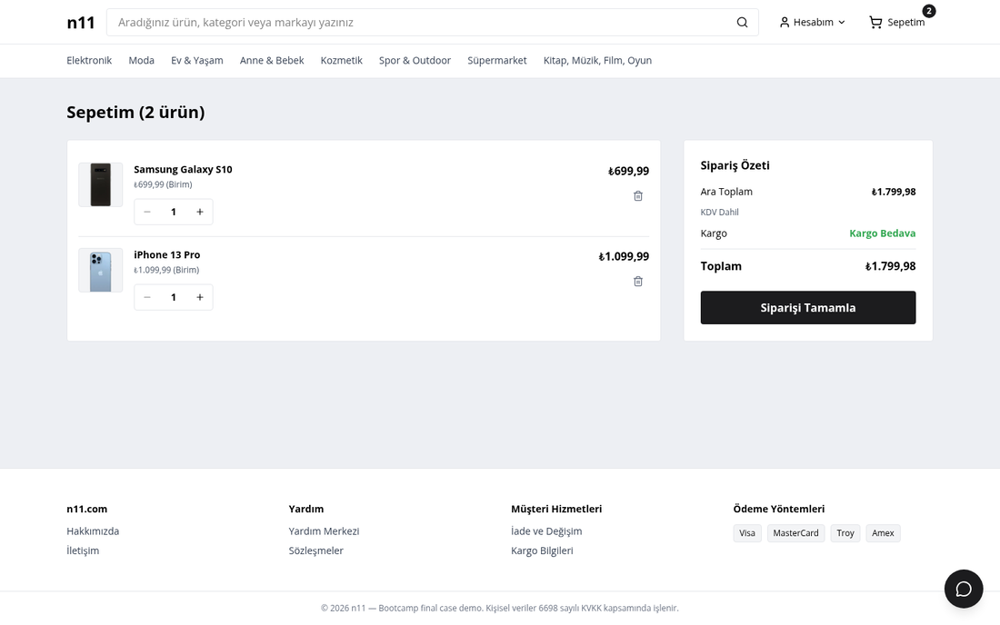
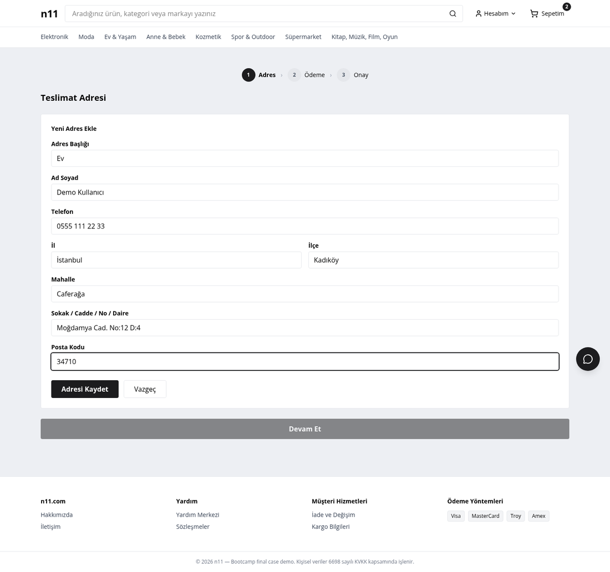
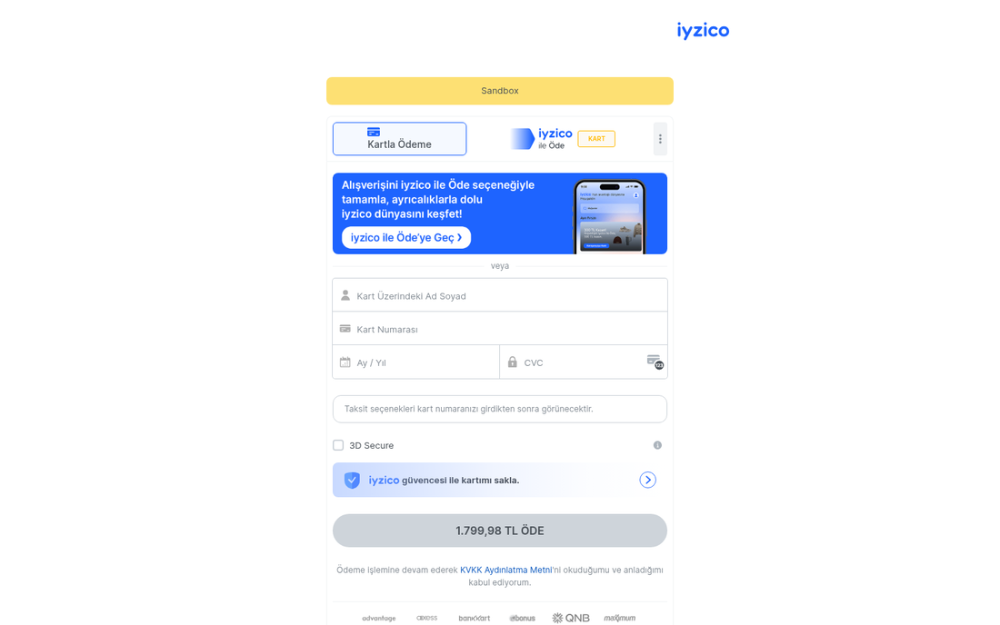
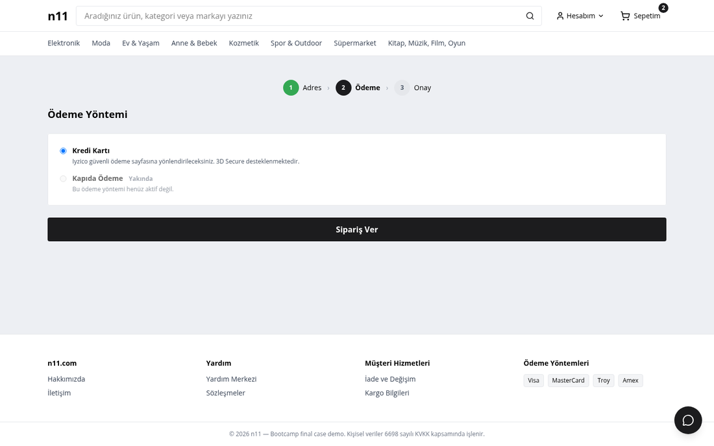
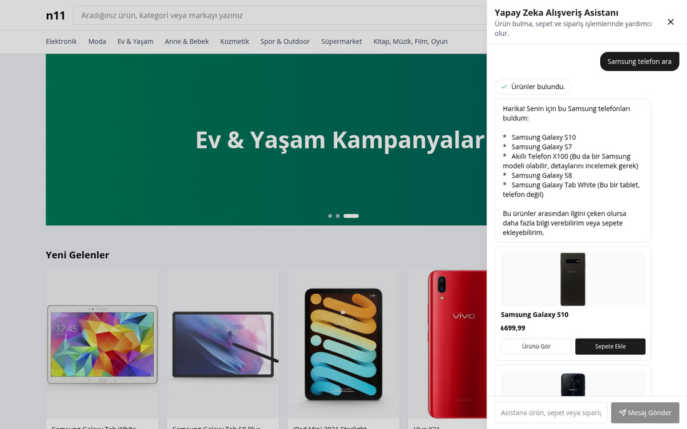

# n11 Bootcamp Final Case — Agentic E-Commerce Clone

> **Patika.dev × n11 Spring Boot Bootcamp** — Final Project

A **13-microservice** Turkish e-commerce platform modeled after [n11.com](https://www.n11.com), built with Spring Boot 3.5, Spring Cloud 2025.0 (Northfields), and a React 19 storefront.

---

## ✨ Highlights

- **13 Microservices** — Eureka discovery, Config Server, API Gateway, plus 10 business services
- **Choreography SAGA** — RabbitMQ event-driven order lifecycle with transactional outbox + idempotency inbox
- **Iyzico Payment Integration** — Full Checkout Form sandbox flow with 3DS, callbacks, timeout compensation
- **AI Shopping Assistant** — Gemini-powered Turkish chat with SSE streaming, multi-turn function-calling (11 tools), and interactive product cards rendered in-chat
- **MCP Server** — Same toolset exposed to external AI agents via MCP Streamable HTTP + stdio transports
- **Provider-Agnostic LLM Abstraction** — `ChatProvider` / `EmbeddingProvider` ports (SOLID demonstration)
- **Turkish-First Storefront** — React 19 + Vite 8 + Tailwind 4 SPA with full Turkish UI copy
- **Zero Cloud Spend** — Runs entirely on docker-compose with Cloudflare Tunnel for public demo URL

---

## 📸 Screens & Demo

### 🤖 AI Shopping Assistant — Turkish, streaming, tool-calling

Ask in plain Turkish. The assistant calls the `search_products` tool, streams its reply over SSE, and renders **interactive product cards** (image, price, *Sepete Ekle*) right inside the chat — no page reload, works the same on localhost and through the public tunnel.

<p align="center">
  
</p>

### 🛍️ Storefront & Checkout

<table>
  <tr>
    <td width="33%"><br><sub><b>Anasayfa</b> — hero + product rails</sub></td>
    <td width="33%"><br><sub><b>Kategori</b> — sort + pagination</sub></td>
    <td width="33%"><br><sub><b>Ürün</b> — taksit table, stock/free-shipping badges</sub></td>
  </tr>
  <tr>
    <td width="33%"><br><sub><b>Sepet</b> — KDV-included totals</sub></td>
    <td width="33%"><br><sub><b>Ödeme</b> — address → payment → confirm</sub></td>
    <td width="33%"><br><sub><b>Iyzico</b> — real sandbox 3DS page</sub></td>
  </tr>
</table>

> Every screenshot is captured from the **live stack running through the Cloudflare tunnel** — the AI cards, prices, badges, installment table, and the Iyzico sandbox total (₺1.799,98) are all real responses, not mockups.

---

## 🏗️ Architecture

```
                         ┌─────────────────────────────────────────────┐
                         │              Cloudflare Tunnel              │
                         │         (Public Demo URL / Webhooks)        │
                         └────────────────────┬────────────────────────┘
                                              │
                                              ▼
┌──────────────┐    ┌─────────────────────────────────────────────────────────┐
│   React 19   │───▶│                   API Gateway :9090                     │
│   Storefront │    │  JWT validation · X-User-Id injection · CORS · routing  │
│   (Vite 8)   │    └─────────────────────────┬───────────────────────────────┘
└──────────────┘                              │
                         ┌────────────────────┼────────────────────┐
                         ▼                    ▼                    ▼
                 ┌──────────────┐   ┌──────────────┐   ┌──────────────────┐
                 │   Identity   │   │   Product    │   │    Inventory     │
                 │   Service    │   │   Service    │   │    Service       │
                 │  :8081       │   │  :8082       │   │   :8083          │
                 └──────────────┘   └──────────────┘   └──────────────────┘
                         │                    │                    │
                         ▼                    ▼                    ▼
                 ┌──────────────┐   ┌──────────────┐   ┌──────────────────┐
                 │    Cart      │   │    Order     │   │    Payment       │
                 │   Service    │   │   Service    │   │    Service       │
                 │  :8084       │   │  :8085       │   │   :8086          │
                 └──────────────┘   └──────────────┘   └──────────────────┘
                                          │                    │
                                          ▼                    ▼
                                  ┌──────────────┐   ┌──────────────────┐
                                  │ Notification │   │   AI Service     │
                                  │   Service    │   │  (Gemini Chat)   │
                                  │  :8087       │   │   :8088          │
                                  └──────────────┘   └──────────────────┘
                                                             │
                         ┌───────────────────────────────────┤
                         ▼                                   ▼
                 ┌──────────────┐                   ┌──────────────────┐
                 │   Search     │                   │   MCP Server     │
                 │   Service    │                   │  (AI Agents)     │
                 │  :8089       │                   │   :8090          │
                 └──────────────┘                   └──────────────────┘

  ┌────────────────────────┐   ┌─────────────────┐   ┌───────────────────┐
  │  PostgreSQL 16 :5432   │   │  RabbitMQ :5672  │   │  Eureka :8761     │
  │  pgvector · 10 schemas │   │  SAGA events     │   │  Config :8888     │
  └────────────────────────┘   └─────────────────┘   └───────────────────┘
```

---

## 📁 Project Structure

### Infrastructure Services

| Service | Port | Purpose | README |
|---------|------|---------|--------|
| [`eureka-server`](./eureka-server) | 8761 | Service discovery (Netflix Eureka) | [README](./eureka-server/README.md) |
| [`config-server`](./config-server) | 8888 | Centralized configuration (native profile) | [README](./config-server/README.md) |
| [`api-gateway`](./api-gateway) | 8080 | Edge gateway — JWT validation, routing, CORS | [README](./api-gateway/README.md) |

### Business Services

| Service | Port | Phase | Purpose | README |
|---------|------|-------|---------|--------|
| [`identity-service`](./identity-service) | 8081 | 3 | User auth, JWT issuance, JWKS, address book | [README](./identity-service/README.md) |
| [`product-service`](./product-service) | 8082 | 4 | Catalog, categories, pagination, ILIKE search | [README](./product-service/README.md) |
| [`inventory-service`](./inventory-service) | 8083 | 4 | Stock management, saga reservation consumer | [README](./inventory-service/README.md) |
| [`cart-service`](./cart-service) | 8084 | 5 | Per-user cart state, product snapshot pricing | [README](./cart-service/README.md) |
| [`order-service`](./order-service) | 8085 | 5 | Order lifecycle, saga initiator, transactional outbox | [README](./order-service/README.md) |
| [`payment-service`](./payment-service) | 8086 | 6 | Iyzico Checkout Form, 3DS callback, timeout job | [README](./payment-service/README.md) |
| [`notification-service`](./notification-service) | 8087 | 7 | Saga leaf consumer, mock email/SMS logging | [README](./notification-service/README.md) |
| [`ai-service`](./ai-service) | 8088 | 8 | Gemini chat, SSE streaming, tool dispatch | [README](./ai-service/README.md) |
| [`search-service`](./search-service) | 8089 | 8 | EmbeddingProvider consumer skeleton (v2: pgvector) | [README](./search-service/README.md) |
| [`mcp-server`](./mcp-server) | 8090 | 9 | MCP wire protocol for external AI agents | [README](./mcp-server/README.md) |

### Shared Modules

| Module | Purpose | README |
|--------|---------|--------|
| [`ai-port`](./ai-port) | Provider-agnostic `ChatProvider` / `EmbeddingProvider` ports (zero deps) | [README](./ai-port/README.md) |
| [`agent-toolset`](./agent-toolset) | 10 canonical agent tools — shared between ai-service and mcp-server | [README](./agent-toolset/README.md) |
| [`common-error`](./common-error) | RFC-7807 `ProblemDetail` error handling | [README](./common-error/README.md) |
| [`common-logging`](./common-logging) | Correlation-ID propagation (HTTP + AMQP + MDC) | [README](./common-logging/README.md) |
| [`common-events`](./common-events) | Saga event schemas + validation test base | [README](./common-events/README.md) |
| [`common-outbox`](./common-outbox) | Transactional outbox poller shared library | [README](./common-outbox/README.md) |

### Frontend

| Project | Stack | README |
|---------|-------|--------|
| [`frontend`](./frontend) | React 19 · Vite 8 · TypeScript · Tailwind 4 · Zustand 5 · TanStack Query 5 | [README](./frontend/README.md) |

---

## 🚀 Quick Start

### Prerequisites

- **Docker** (with Docker Compose v2)
- **Java 21** (for Gradle/Jib builds)
- **Node.js 20+** (for frontend dev server)

### 1. Configure environment

```bash
cp .env.example .env
# Edit .env — fill in JWT_PRIVATE_KEY, GEMINI_API_KEY, IYZICO keys
# See .env.example comments for generation instructions
```

### 2. Build all backend images

```bash
./gradlew jibDockerBuild
```

### 3. Start the full stack

```bash
docker compose up -d
```

### 4. Start the frontend (dev mode)

```bash
cd frontend && npm install && npm run dev
```

### 5. Verify

```bash
# Gateway health
curl http://localhost:9090/actuator/health

# Products listing
curl http://localhost:9090/api/v1/products

# Frontend (Vite dev server; same-origin /api proxied to the gateway)
open http://localhost:8083
```

---

## 🗓️ Build Journey — 11 Phases

This project was built in **11 phases** using AI-assisted execution. Each phase had explicit success criteria, plans, and human verification gates.

### Phase 1 — Foundations + Day-1 Contracts

Established the Gradle multi-module skeleton with 13 service stubs, infrastructure (Postgres 16 + pgvector, RabbitMQ 4.x), and locked the **saga contracts** (`saga-contracts.md`) and **REST API contracts** (`api-contracts.md`) that every downstream service depends on. Schema-per-service boundary enforced via 10 distinct DB users with role-level cross-schema REVOKE deny matrix.

**Key deliverables:** `docker-compose.yml`, `infra/postgres/init.sh`, `common-error`, `common-logging`, `common-events`, `eureka-server`, `config-server`, `api-gateway` shell.

### Phase 2 — Frontend Recon + Toolchain Lock

Ran **Playwright** against [n11.com](https://www.n11.com) to capture real layout structure, Turkish copy patterns (644 phrases), color tokens (25), and category taxonomy. Locked the frontend toolchain: **Vite 8 + React 19 SPA + TypeScript strict + Tailwind 4 + Zustand 5**.

**Key deliverables:** `.planning/intel/n11-recon.md` (8 sections, screenshots), toolchain decision in `PROJECT.md`.

### Phase 3 — Identity + Gateway Auth

`identity-service` issues **RS256 JWTs** (24h TTL, BCrypt cost 10), serves JWKS at `/.well-known/jwks.json`. API Gateway validates JWT via Nimbus, strips `Authorization`, injects `X-User-Id` / `X-User-Email` / `X-User-Roles`. Transactional outbox publishes `user.registered` events.

**Key deliverables:** Auth flow, address book (Türkiye addresses), admin seed migration.

### Phase 4 — Catalog + Inventory

`product-service` with **50+ Turkish seed products** across 8 categories. Paginated listing, sort (price/date), free-text **ILIKE search** with GIN trigram index. `inventory-service` manages stock with `@Version` optimistic locking and Turkish stock labels ("Stokta", "Tükendi", "Son N ürün!").

**Key deliverables:** Product CRUD, category hierarchy, stock reservation saga consumer.

### Phase 5 — Cart & Order Skeleton

`cart-service` (per-user cart state, product-snapshot pricing) and `order-service` (saga initiator, `Idempotency-Key` dedup, transactional outbox). Proved the **choreography SAGA end-to-end** on real RabbitMQ: `OrderCreated → StockReserved → PaymentCompleted → OrderConfirmed` in ~3 seconds.

**Key deliverables:** `common-outbox` shared module, full saga skeleton, ArchUnit idempotency gate.

### Phase 6 — Payment (Iyzico)

Integrated **Iyzico Checkout Form** (sandbox) with 3DS support. Public webhook via Cloudflare Tunnel. Payment-timeout scheduled job for stuck orders. Full compensation path: `PaymentFailed → StockReleased → OrderCancelled`.

**Key deliverables:** Live sandbox smoke test with test card `5528 7900 0000 0008`, callback troubleshooting runbook.

### Phase 7 — Notification (Saga Closure)

`notification-service` as a fully independent saga leaf consumer. Consumes 4 event types (`order.confirmed`, `order.cancelled`, `payment.failed`, `user.registered`), logs structured Turkish "email payloads", and closes the saga loop.

**Key deliverables:** QUAL-04 saga integration test, `notifications` audit table.

### Phase 8 — AI Port + Adapter + Agent Toolset

The **SOLID centerpiece**: `ai-port` module with zero Gemini SDK dependencies. `GeminiChatAdapter` + `GeminiEmbeddingAdapter` (google-genai 1.52.0). `EchoChatProvider` second adapter proves port substitutability. `agent-toolset` shared module with **10 canonical tools**. `ai-service` chat with Turkish system prompt, function-calling loop (max 6 rounds), SSE streaming, conversation persistence.

**Key deliverables:** Provider-agnostic abstraction, tool dispatch with ID provenance validation, search-service skeleton consuming `EmbeddingProvider`.

### Phase 9 — MCP Server

`mcp-server` using Spring AI MCP 1.1.5. Registers the **same `agent-toolset`** (zero local tool definitions). Dual transport: stdio (Claude Desktop) + HTTP+SSE (network). Auth bridge: `MCP_API_KEY` → `/agents/exchange` → internal JWT.

**Key deliverables:** DRY proof (infra-test catalog equality), human-verified demo flow with Claude Desktop.

### Phase 10 — Frontend Storefront

Full Turkish React storefront: sticky header, hero carousel, category navigation, paginated listing, PDP with image gallery + taksit table + KDV-inclusive pricing, cart with qty stepper, multi-step checkout (address → Iyzico form → confirmation), account section with order timeline, login/register with Turkish validation.

**Key deliverables:** 32 Vitest unit tests, Playwright E2E smoke, `Intl.NumberFormat('tr-TR')` formatting throughout.

### Phase 11 — Chat Assistant + DevOps Deploy

Floating **AI chat bubble** (bottom-right, every page) with SSE token streaming, tool-use chips, compact product cards. Jib images for all 13 services. GitHub Actions CI (build + test on push/PR, Jib → GHCR on `v*` tag). Local docker-compose deploy. Slack notifications. Jenkins comparison doc.

**Key deliverables:** Chat ↔ cart bridge (1-second badge update), public demo URL via tunnel, full deploy runbook.

---

## 🔄 Order Saga Flow

```
  ┌──────────────┐    order.created     ┌───────────────────┐
  │ order-service │──────────────────────▶│ inventory-service │
  │  (initiator)  │                      │  (stock reserve)  │
  └──────┬───────┘                      └────────┬──────────┘
         │                                       │
         │  ◄── stock.reserved ──────────────────┘
         │  ◄── stock.reserve_failed ────────────┘
         │
         │         stock.reserved        ┌───────────────────┐
         │ ─────────────────────────────▶│ payment-service    │
         │                               │  (Iyzico checkout) │
         │                               └────────┬──────────┘
         │                                        │
         │  ◄── payment.completed ───────────────┘
         │  ◄── payment.failed ──────────────────┘
         │
         │         order.confirmed       ┌───────────────────┐
         │ ─────────────────────────────▶│ notification-svc   │
         │                               │ cart-service        │
         │         order.cancelled       └───────────────────┘
         │ ─────────────────────────────▶│ inventory (release) │
         └──────────────────────────────▶│ notification-svc    │
                                         └────────────────────┘
```

**Happy path:** `PENDING → STOCK_RESERVED → PAID → CONFIRMED`
**Compensation:** `PaymentFailed → StockReleased → OrderCancelled`

All saga consumers are **idempotent** (processed_events inbox table). All producers use the **transactional outbox** pattern (no dual-writes).

---

## 🤖 AI & Agent Architecture

```
┌──────────────┐     ┌────────────────────────┐     ┌──────────────┐
│  ai-port     │     │     agent-toolset      │     │ google-genai │
│ (zero deps)  │     │   (10 shared tools)    │     │  1.52.0      │
│              │     │                        │     │              │
│ ChatProvider │     │ search_products        │     │ GeminiChat   │
│ Embedding    │     │ get_product            │     │  Adapter     │
│  Provider    │     │ list_categories        │     │ GeminiEmbed  │
│              │     │ add_to_cart            │     │  Adapter     │
│ EchoChat     │     │ view_cart              │     │              │
│  Provider    │     │ update_cart_item       │     │              │
│ (test swap)  │     │ remove_from_cart       │     │              │
└──────┬───────┘     │ create_order           │     └──────────────┘
       │             │ get_payment_link       │
       ▼             │ get_order_status       │
┌──────────────┐     └───────────┬────────────┘
│  ai-service  │◄────────────────┘
│  (chat, SSE) │
└──────────────┘
       ▲
       │ same toolset
       ▼
┌──────────────┐
│  mcp-server  │  ← Claude Desktop / MCP Inspector
│  (MCP wire)  │
└──────────────┘
```

**Key design principle:** One toolset, two surfaces. The `agent-toolset` module is imported by both `ai-service` and `mcp-server`. Zero tool definitions are duplicated.

---

## 🔐 Security Model

| Concern | Implementation |
|---------|---------------|
| **JWT Issuance** | RS256 signed by `identity-service`, 24h TTL |
| **JWT Validation** | API Gateway only (Nimbus + JWKS, 1h refresh) |
| **Header Injection** | Gateway strips `Authorization`, injects `X-User-Id` / `X-User-Roles` |
| **DB Isolation** | Schema-per-service + distinct DB users + cross-schema REVOKE deny matrix |
| **Secrets** | All via `.env` (gitignored); gitleaks CI; no secrets in source |
| **Iyzico** | Sandbox keys via env; callback signature verified server-side |
| **MCP Auth** | API key → `/agents/exchange` → internal JWT (same RS256 path) |

---

## 🧪 Testing Strategy

| Layer | Tool | Coverage |
|-------|------|----------|
| **Unit** | JUnit 5 + Vitest | Smoke unit per service (password hashing, stock labels, Turkish copy) |
| **Integration** | Testcontainers (Postgres + RabbitMQ) + Awaitility | Saga idempotency, outbox drain, cross-service flows |
| **Architecture** | ArchUnit | AMQP ack-mode gate (no MANUAL ack without Channel) |
| **E2E** | Playwright | Frontend smoke (login → browse → cart → checkout) |
| **Contract** | JSON Schema validation | Saga event envelope + payload validation |

```bash
# Run all backend tests
./gradlew test

# Run frontend tests
cd frontend && npm test

# Run Playwright E2E
cd frontend && npx playwright test
```

---

## 🌐 Environment Matrix

All secrets live in the root `.env` file (gitignored). **Never commit real keys.**

### Required Secrets

| Variable | Source | Description |
|----------|--------|-------------|
| `JWT_PRIVATE_KEY` | `openssl genrsa 2048` | RS256 private key (PEM PKCS#8) |
| `GEMINI_API_KEY` | [Google AI Studio](https://aistudio.google.com/apikey) | Gemini API key for chat + embeddings |
| `IYZICO_API_KEY` | [Iyzico Sandbox](https://sandbox.iyzipay.com) | Sandbox API key |
| `IYZICO_SECRET_KEY` | Iyzico Sandbox | Sandbox secret key |
| `PUBLIC_BASE_URL` | Your tunnel URL | HTTPS URL for Iyzico callbacks |

### Public Config

| Variable | Default | Description |
|----------|---------|-------------|
| `VITE_API_BASE_URL` | _(empty)_ | Leave empty: the SPA makes same-origin `/api` requests that Vite proxies to the gateway — works on localhost and through the Cloudflare tunnel. Set only to target a gateway on a different origin from the browser. |
| `VITE_PROXY_TARGET` | `http://api-gateway:8080` | Where the Vite dev server forwards `/api` (in compose: the gateway service; for host `npm run dev`: `http://localhost:9090`). |
| `IMAGE_REGISTRY` | `n11` | Docker image registry prefix |
| `IMAGE_TAG` | `dev` | Docker image tag |

See [`.env.example`](./.env.example) for the complete variable reference with generation instructions.

---

## 💳 Iyzico Sandbox Demo

Test card for the happy path:

| Field | Value |
|-------|-------|
| **Card number** | `5528 7900 0000 0008` |
| **Cardholder** | `John Doe` |
| **Expiry** | `12/30` |
| **CVC** | `123` |
| **3DS OTP** | `283356` |

**Flow:** Add to cart → Checkout → Select address → choose **Kredi Kartı** → Sipariş Ver → redirected to the Iyzico sandbox page → enter test card → complete 3DS → Order CONFIRMED.

<p align="center">
  
</p>

> Full test card matrix (decline, 3DS edge cases, timeout) is in [`payment-service/README.md`](./payment-service/README.md).

---

## 🤖 AI Assistant Demo



1. Open the storefront (`http://localhost:8083`, or the public tunnel URL)
2. Click the floating **Yapay Zeka Alışveriş Asistanı** bubble (bottom-right)
3. Type `Samsung telefon ara` — the assistant calls `search_products`, streams a Turkish reply over SSE, and renders product cards
4. Click **Sepete Ekle** on a card — the header cart badge updates within ~1 second (guests are routed to login first)
5. Ask `Sepetimde ne var?` — the assistant summarizes the cart
6. Proceed to checkout from the cart page

The assistant keeps multi-turn context within a session (the chat stays mounted across page navigation); each new browser session starts a fresh conversation.

---

## 🔌 MCP External Agent Demo

The same toolset is exposed to external AI agents via MCP at `/mcp/**` through the gateway.

1. Ensure tunnel is running and `MCP_API_KEY` is set
2. Configure Claude Desktop or MCP Inspector:
   ```
   https://<DEMO_TUNNEL_HOSTNAME>/mcp/
   ```
3. Authenticate with `MCP_API_KEY`
4. Available tools: `search_products`, `get_product`, `list_categories`, `add_to_cart`, `view_cart`, `update_cart_item`, `remove_from_cart`, `create_order`, `get_payment_link`, `get_order_status`

> The MCP server is stateless and shares the exact same `agent-toolset` module as `ai-service`.

---

## 🛠️ Tech Stack

| Layer | Technology | Version |
|-------|-----------|---------|
| **Language** | Java | 21 (LTS) |
| **Framework** | Spring Boot | 3.5.14 |
| **Cloud** | Spring Cloud (Northfields) | 2025.0.0 |
| **Database** | PostgreSQL + pgvector | 16 + 0.8.x |
| **Messaging** | RabbitMQ | 4.3 |
| **AI** | google-genai SDK | 1.52.0 |
| **AI Model** | Gemini | gemini-3-flash-preview |
| **Embeddings** | Gemini | gemini-embedding-2 |
| **MCP** | Spring AI MCP | 1.1.5 |
| **Build** | Gradle + Jib | 8.x + 3.5.3 |
| **Frontend** | React + Vite + TypeScript | 19 + 8 + strict |
| **Styling** | Tailwind CSS | 4 |
| **State** | Zustand + TanStack Query | 5 + 5 |
| **CI/CD** | GitHub Actions | — |
| **Security** | gitleaks | — |

---

## 🏃 CI/CD

### GitHub Actions Workflows

| Workflow | Trigger | Purpose |
|----------|---------|---------|
| [`ci.yml`](./.github/workflows/ci.yml) | Push / PR | Build + test all 13 services |
| [`release.yml`](./.github/workflows/release.yml) | `v*` tag | Jib → GHCR for all services |
| [`security.yml`](./.github/workflows/security.yml) | Push / PR | gitleaks secret scanning |

### Slack Notifications

Build success/failure notifications are sent to the configured Slack webhook:
- `✅ build green on <ref>`
- `❌ build failed on <ref>`

---

## 📡 Tunnel Setup

### Cloudflare Tunnel (Preferred)

```bash
cloudflared tunnel login
cloudflared tunnel create n11-demo
cloudflared tunnel route dns n11-demo n11-demo.<ZONE>
cloudflared tunnel run n11-demo
```

### ngrok (Fallback)

```bash
ngrok http 9090
# Update PUBLIC_BASE_URL in .env with the forwarding URL
```

See the [tunnel setup guide](#) in the root README sections below for full step-by-step instructions.

---

## ❓ Troubleshooting

| Problem | Solution |
|---------|----------|
| `no such image` on compose up | Run `./gradlew jibDockerBuild` first |
| Tunnel returns non-200 | Check `docker compose ps`, verify gateway at `localhost:9090` |
| Iyzico payment stays PENDING | Verify `PUBLIC_BASE_URL` is reachable, tunnel is connected |
| Frontend shows "Bir hata oluştu" | Keep `VITE_API_BASE_URL` empty (same-origin) and ensure `VITE_PROXY_TARGET` points at the gateway (`http://api-gateway:8080` in compose, `http://localhost:9090` for host `npm run dev`); confirm the gateway is healthy |
| Gateway 401 on all routes | Verify `JWT_PRIVATE_KEY` is set in `.env` and identity-service is healthy |
| Chat assistant not responding | Verify `GEMINI_API_KEY` is set and valid |

---

## 📄 License

Built for the **Patika.dev × n11 Spring Boot Bootcamp** final case.

]]>
